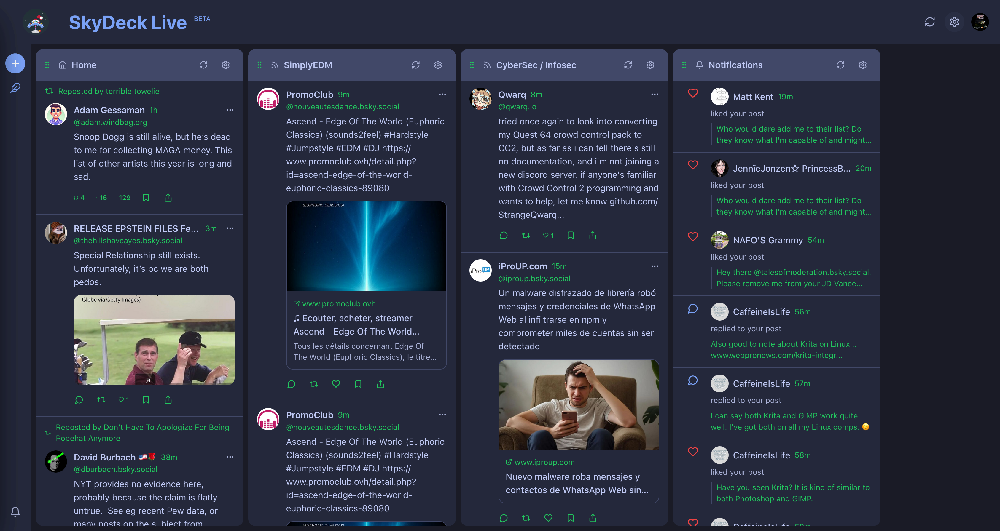

# SkyDeck

A feature-complete Bluesky social media web frontend with a multi-column "deck" interface, inspired by [deck.blue](https://deck.blue).



## Features

### Core Features
- **Multi-Column Layout**: Drag-and-drop customizable columns for Home, Notifications, Messages, Search, Lists, Custom Feeds, Profiles, Likes, Bookmarks, and Hashtags
- **Independent Column Scrolling**: Each column scrolls independently from the main window
- **Full Bluesky Integration**: Complete ATProto API support for posts, feeds, DMs, notifications, and moderation
- **Theme Customization**: Full control over colors, typography, layout, and custom CSS
- **Real-time Updates**: WebSocket-powered live feeds and notifications
- **Responsive Design**: Works on desktop and mobile
- **Accessible**: WCAG 2.2 compliant with keyboard navigation
- **Custom PDS Support**: Connect to any AT Protocol PDS, not just bsky.social
- **Two-Factor Authentication**: Full 2FA support for login
- **Feed Deduplication**: Smart deduplication prevents duplicate posts when scrolling or refreshing feeds

### Post Composer
- **Slide-Out Composer**: Full-featured post composer that slides out from the left sidebar
- **Image Upload**: Upload up to 4 images per post with alt text support
- **Video Upload**: Upload videos (MP4, WebM, MOV) up to 50MB with progress indicator
- **GIF Search**: Integrated GIPHY search for adding animated GIFs to posts
- **Quote Posts**: Quote other posts with optional text and media attachments
- **Reply Support**: Reply to posts directly from the feed or post viewer
- **Hashtag Autocomplete**: Type `#` to see popular hashtag suggestions as you type
- **Paste Support**: Paste images and videos directly into the composer
- **Drafts**: Save posts as drafts and edit them later
- **Scheduled Posts**: Schedule posts to be automatically published at a future date/time

### Post Display
- **Post Viewer Modal**: Click any post to open a detailed view with full thread context
- **Thread Navigation**: View parent posts and all replies in the post viewer
- **Quote Post Display**: Quoted posts are displayed in full with embedded media
- **Repost Indicators**: Clear visual indication of reposts with attribution
- **User Display**: Username and handle shown on separate lines for clarity

### Media Support
- **Images**: Full-size image lightbox with alt text display
- **Videos**: Video preview with playback controls
- **External Links**: Rich link previews with thumbnails
- **GIFs**: Animated GIF support via GIPHY integration

### Bookmarks
- **Local Bookmarks**: Save posts locally to your SkyDeck account
- **Bookmarks Column**: View all your bookmarked posts in a dedicated column
- **Quick Toggle**: Bookmark/unbookmark posts with a single click

### Lists Management
- **Create Lists**: Create curate lists and moderation lists directly in SkyDeck
- **Manage Members**: Add and remove members from your lists
- **User Search**: Search for users to add to lists
- **Edit & Delete**: Update list names/descriptions or delete lists

### Keyboard Shortcuts
- **Navigation**: `j`/`k` for next/previous post, `h`/`l` for column navigation
- **Actions**: `n` for new post, `r` for reply, `l` for like, `t` for repost
- **Go-To**: `g` then `h` for home, `g` then `n` for notifications, etc.
- **Help**: Press `?` to view all available shortcuts

### Hashtag Columns
- **Track Hashtags**: Add columns to follow specific hashtags
- **Real-time Updates**: Hashtag columns update automatically like other feeds

### Moderation Tools
- Block, mute, report, and word filtering
- Content label controls (hide, warn, ignore)
- Adult content toggle
- **Thread Muting**: Mute individual threads to stop notifications without blocking users

### Social Discovery
- **Suggested Follows**: View similar accounts to follow when viewing other users' profiles
- **Known Followers**: See mutual connections ("Followed by X, Y, and 3 others you follow") on profiles
- **Starter Packs**: Browse and discover starter packs created by users, view member counts and join stats

## Tech Stack

### Backend
- Node.js 20+ with Express.js
- PostgreSQL with Prisma ORM
- Redis for caching and sessions
- Socket.io for real-time updates
- @atproto/api for Bluesky integration

### Frontend
- React 18 with Vite
- TailwindCSS for styling
- Zustand for state management
- @dnd-kit for drag-and-drop
- React Query for data fetching

## Quick Start

### Prerequisites
- Node.js 20+
- Docker and Docker Compose
- A Bluesky account

### Development Setup

1. Clone the repository:
```bash
git clone https://github.com/yourusername/skydeck.git
cd skydeck
```

2. Start the database and Redis:
```bash
docker-compose up -d postgres redis
```

3. Set up the backend:
```bash
cd backend
cp .env.example .env
npm install
npx prisma generate
npx prisma db push
npm run dev
```

4. Set up the frontend (in a new terminal):
```bash
cd frontend
npm install
npm run dev
```

5. Open http://localhost:5173 in your browser

### Production Deployment

1. Create a `.env` file with your secrets:
```bash
JWT_SECRET=your-secure-jwt-secret
SESSION_SECRET=your-secure-session-secret
```

2. Build and run with Docker Compose:
```bash
docker-compose up -d
```

3. Access the app at http://localhost:5173

## Project Structure

```
skydeck/
├── backend/
│   ├── src/
│   │   ├── config/          # Configuration
│   │   ├── routes/          # API routes
│   │   ├── services/        # Business logic
│   │   ├── middleware/      # Express middleware
│   │   ├── utils/           # Utilities
│   │   ├── socket/          # WebSocket handlers
│   │   └── jobs/            # Background jobs
│   └── prisma/              # Database schema
├── frontend/
│   ├── src/
│   │   ├── components/      # React components
│   │   ├── pages/           # Page components
│   │   ├── stores/          # Zustand stores
│   │   ├── hooks/           # Custom hooks
│   │   ├── services/        # API services
│   │   └── utils/           # Utilities
│   └── public/              # Static assets
├── docker-compose.yml
└── README.md
```

## API Endpoints

### Authentication
- `POST /api/auth/login` - Login with Bluesky credentials (supports 2FA and custom PDS)
- `POST /api/auth/logout` - Logout current session
- `GET /api/auth/me` - Get current user

### Posts
- `POST /api/posts` - Create a post
- `GET /api/posts/:uri` - Get post thread
- `DELETE /api/posts/:uri` - Delete a post
- `POST /api/posts/:uri/like` - Like a post
- `POST /api/posts/:uri/repost` - Repost
- `POST /api/posts/:uri/mute-thread` - Mute a thread
- `DELETE /api/posts/:uri/mute-thread` - Unmute a thread

### Feeds
- `GET /api/feeds/timeline` - Get home timeline
- `GET /api/feeds/feed/:feedUri` - Get custom feed
- `GET /api/feeds/mentions` - Get mentions
- `GET /api/feeds/saved` - Get user's saved custom feeds
- `GET /api/feeds/suggested` - Get suggested feeds to discover

### Media
- `POST /api/media/images` - Upload images (up to 4)
- `POST /api/media/video` - Upload video file
- `GET /api/media/giphy/search` - Search GIPHY for GIFs
- `GET /api/media/giphy/trending` - Get trending GIFs

### Columns
- `GET /api/columns` - Get user's columns
- `POST /api/columns` - Create column (supports hashtag columns)
- `PATCH /api/columns/:id` - Update column
- `DELETE /api/columns/:id` - Delete column
- `POST /api/columns/reorder` - Reorder columns

### Themes
- `GET /api/themes` - Get user's theme
- `PATCH /api/themes` - Update theme
- `POST /api/themes/reset` - Reset to default
- `GET /api/themes/presets` - Get theme presets

### Bookmarks
- `GET /api/bookmarks` - Get user's bookmarks
- `POST /api/bookmarks` - Add bookmark
- `DELETE /api/bookmarks/:id` - Remove bookmark by ID
- `DELETE /api/bookmarks/post/:uri` - Remove bookmark by post URI
- `GET /api/bookmarks/check/:uri` - Check if post is bookmarked

### Drafts & Scheduled Posts
- `GET /api/drafts` - Get all drafts
- `GET /api/drafts/scheduled` - Get scheduled posts
- `POST /api/drafts` - Save draft or schedule post
- `PATCH /api/drafts/:id` - Update draft
- `DELETE /api/drafts/:id` - Delete draft
- `POST /api/drafts/:id/post` - Post draft immediately
- `GET /api/drafts/counts/all` - Get draft and scheduled counts

### Lists
- `GET /api/lists` - Get user's lists
- `GET /api/lists/:uri` - Get list with members
- `POST /api/lists` - Create list (curate or moderation)
- `PATCH /api/lists/:rkey` - Update list
- `DELETE /api/lists/:rkey` - Delete list
- `POST /api/lists/:uri/members` - Add member to list
- `DELETE /api/lists/:uri/members/:rkey` - Remove member from list

### Users & Social
- `GET /api/users/:actor` - Get user profile
- `GET /api/users/:actor/followers` - Get user's followers
- `GET /api/users/:actor/follows` - Get user's follows
- `GET /api/users/:actor/suggested-follows` - Get suggested accounts to follow based on user
- `GET /api/users/:actor/known-followers` - Get mutual/known followers
- `GET /api/users/:actor/starter-packs` - Get user's starter packs
- `POST /api/users/:did/follow` - Follow a user
- `DELETE /api/users/:did/follow` - Unfollow a user

### Search
- `GET /api/search/posts` - Search posts
- `GET /api/search/users` - Search users
- `GET /api/search/starter-packs` - Search starter packs
- `GET /api/search/starter-pack` - Get a specific starter pack by URI

## Configuration

### Environment Variables

| Variable | Description | Default |
|----------|-------------|---------|
| `PORT` | Backend server port | 3001 |
| `DATABASE_URL` | PostgreSQL connection string | - |
| `REDIS_URL` | Redis connection string | redis://localhost:6379 |
| `JWT_SECRET` | JWT signing secret | - |
| `SESSION_SECRET` | Session secret | - |
| `BLUESKY_SERVICE` | Bluesky API service URL | https://bsky.social |
| `BLUESKY_CHAT_SERVICE` | Bluesky Chat API URL | https://api.bsky.chat |
| `FRONTEND_URL` | Frontend URL for CORS | http://localhost:5173 |

## Contributing

1. Fork the repository
2. Create your feature branch (`git checkout -b feature/amazing-feature`)
3. Commit your changes (`git commit -m 'Add some amazing feature'`)
4. Push to the branch (`git push origin feature/amazing-feature`)
5. Open a Pull Request

## License

This project is licensed under the MIT License - see the [LICENSE](LICENSE) file for details.

## Acknowledgments

- [Bluesky](https://bsky.app) for the amazing decentralized social platform
- [deck.blue](https://deck.blue) for the design inspiration
- The ATProto team for the excellent SDK
